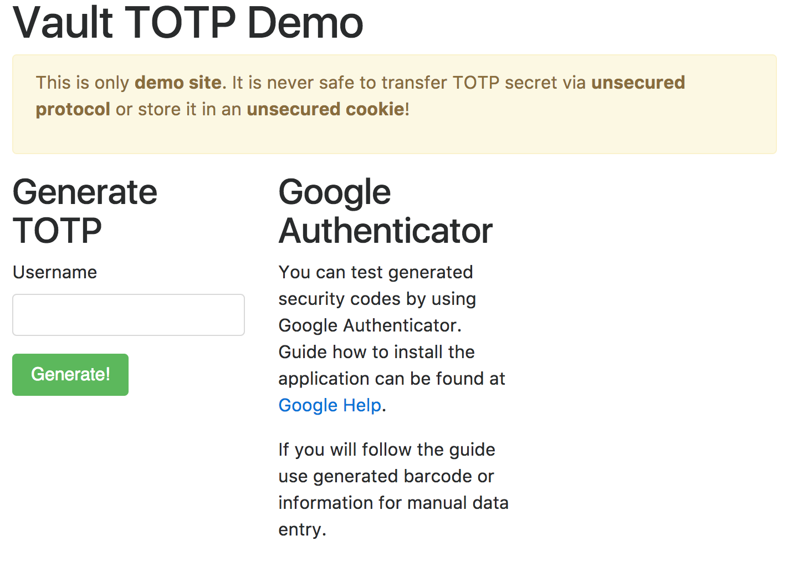

Spring Boot with Spring Vault TOTP Example
==========================================

This example shows Vault's TOTP backend use (since Vault 0.7.2) with Spring Vault.

The demo application requires Vault to be initialized (see top-level [readme](https://github.com/mp911de/spring-cloud-vault-config-samples#setup)).

Run the main class `example.totp.TotpApplication` and open your browser 
at http://localhost:8080 once the application started up.

You should see a screen like:

Enter any username. On the second page you'll be prompted to scan the QR code
and enter the TOTP code for verification.
